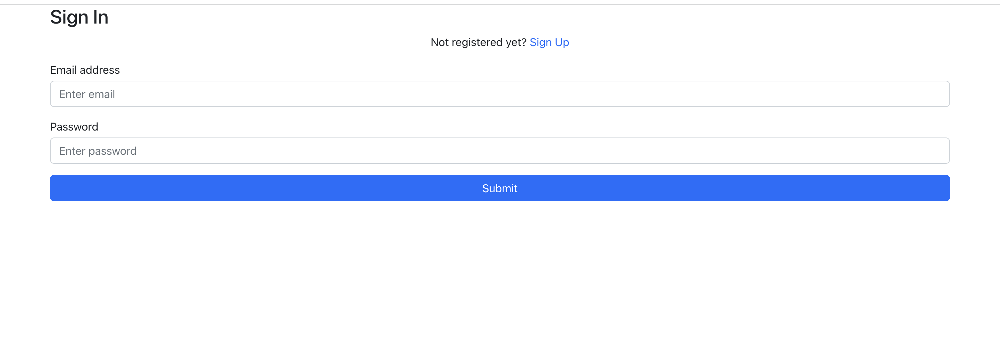
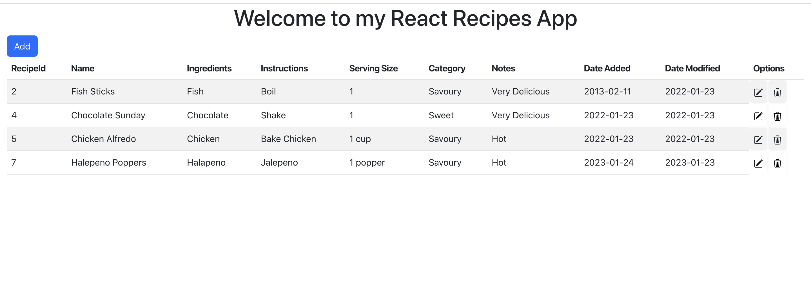
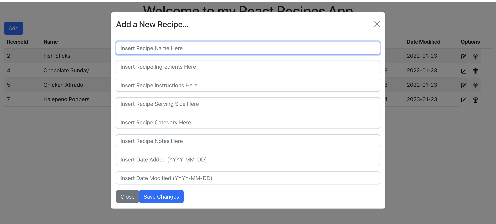

# BioRad_React_Recipe_App
 
## Introduction ##

The purpose of this project was to create a sample recipes page to Add, Update, and Delete recipes

## Screenshots ## 

|  | 
|:--:| 
| *Login Page* |

|  | 
|:--:| 
| *Recipes Home Page* |

|  | 
|:--:| 
| *Adding A New Recipe* |

## Setup ##

### Starting the Django Server ###

Depending on if you have Python3 or Python 2 and lower, the following command will be different

### Python 3 ###
```
cd BioRad_React_Recipe_App/recipes/src/Server/DjangoAPI/
python3 manage.py runserver
```

### Python 2 and lower ###
```
cd BioRad_React_Recipe_App/recipes/src/Server/DjangoAPI/
python manage.py runserver
```

### Starting the Node Server ### 

```
cd BioRad_React_Recipe_App/recipes/src/
npm start
```

Note: On my machine, my React server runs on `http://localhost:3000/` and my Django Server runs on `http://127.0.0.1:8000/`

